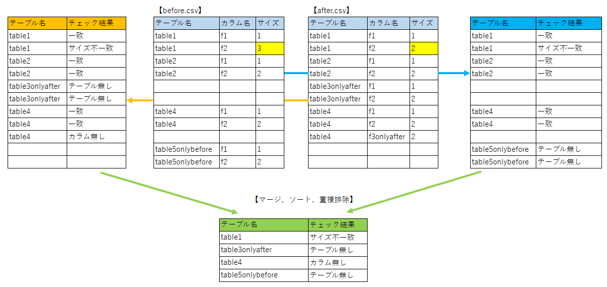

# csv-diff

## 処理イメージ

* `変更前（before.csv）`の各行のキーを使って、`変更後（after.csv）`を検索し、一致レコードがあれば比較する
  - 比較して差異がなければ正常、差異があれば不一致メッセージ
  - 一致レコードがなければメッセージ（`テーブル無し` or `カラム無し`）を出力
  - 変更後（after.csv）だけに存在する行は放置となる。
* 逆に実施する。
* `変更後（after.csv）`の各行のキーを使って、`変更前（before.csv）`を検索し、一致があれば比較する
  - 比較して差異がなければ正常、差異があれば不一致メッセージ
  - 一致レコードがなければメッセージ（`テーブル無し` or `カラム無し`）を出力
  - 変更前（before.csv）だけに存在する行は放置となる。
* 上記２つの比較結果を、マージして、ソートして、重複排除する

